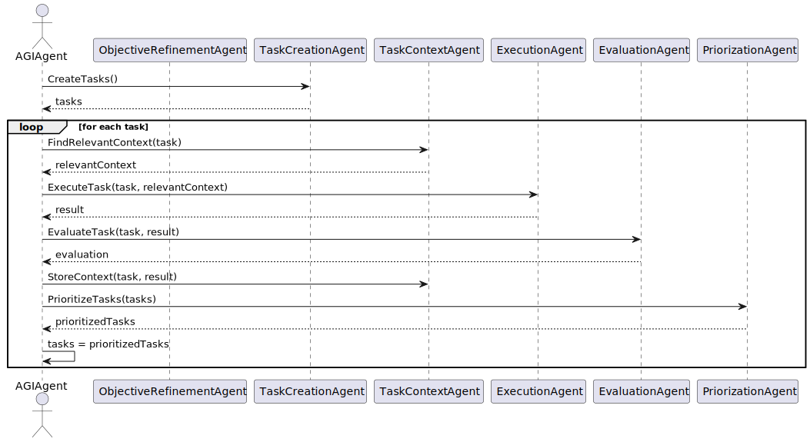
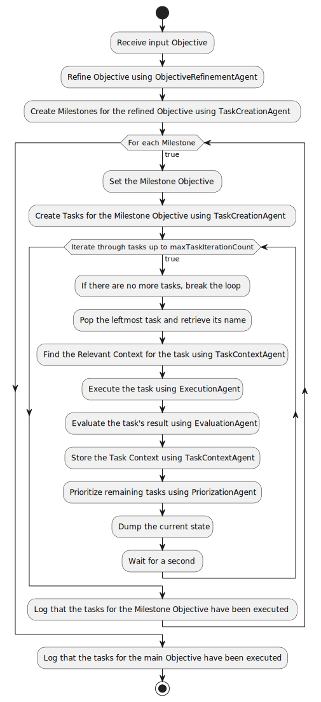

# Lightweight AGI (LW-AGI)

## LW-AGI is Golang-based General AI with Flexible Language Models


Lightweight AGI is a project aimed at creating a simple and effective Artificial General Intelligence (AGI) agent using Golang and versatile Large Language Models (LLMs) compatible with the LLMClient interface. The agent is designed to handle a wide range of objectives by refining objectives, executing tasks, evaluating results, and prioritizing further tasks. With its adaptable architecture, Lightweight AGI can be applied to various domains, including but not limited to gaming, problem-solving, and knowledge acquisition.

**This project is currently under development, and its effectiveness has not yet been thoroughly tested at the individual level. However, given the growing interest in developing general artificial intelligence, we believe it is important to share the potential value of this project and evolve it together with the community. With that in mind, we kindly ask for your understanding as you read this article.**

## Key Features

- **Objective Refinement**: A unique and innovative approach to refining the main objective into smaller, more manageable objectives, enabling the AGI agent to tackle complex problems effectively.
- Task Creation: Generates tasks and milestones based on the refined objectives.
- Execution Agent: Executes tasks using the OpenAI GPT-4 model (or GPT-3.5 model).
- Evaluation Agent: Evaluates the results of tasks and their effectiveness.
- Prioritization Agent: Prioritizes tasks based on their relevance and importance.
- Task Context Agent: Stores the context of tasks for future reference.
- **In-Memory Vector Store**: Supports an efficient in-memory vector store to save embedding vectors, which can be queried for similarity, enabling faster access and improved performance.

## Note: Currently Supported LLM Provider

While Lightweight AGI is designed to be flexible and work with various Large Language Models (LLMs) that satisfy the LLMClient interface, please be aware that, as of now, the project only supports OpenAI's GPT-4 or GPT-3.5 as the LLM provider.

Future updates may include support for additional LLM providers. Stay tuned for further developments and enhancements to the Lightweight AGI project.


## Installation
1. Install Go and set up your Go workspace.
2. Clone the repository:

```bash
git clone https://github.com/zawakin/lightweight-agi.git
```

3. Navigate to the repository:
```bash
cd lightweight-agi
```

4. Install the required packages:
```bash
go mod download
```

5. Create a .env file with your OpenAI API key:
```makefile
OPENAI_API_KEY=your_openai_api_key_here
```

## Usage

Run the main program:

```bash
go run ./cmd/main.go
```

The AGI agent will start learning how to play chess by executing tasks, evaluating results, and refining its objectives.

## Sequence Diagram



## Flowchart



## Example Output

```
======= Objective ======
I want to learn how to play chess.


======= Refined Objective ======
I want to learn the basic rules, strategies, and tactics of chess to play at an intermediate level.

======= Milestones ======
1. Familiarize with the chessboard layout and the movement of each piece.
2. Learn the basic rules of chess, including check, checkmate, and stalemate.
3. Study and practice basic opening principles and strategies.
4. Understand and apply the concept of piece value and material advantage in gameplay.
5. Learn common tactical patterns, such as forks, pins, and skewers.
6. Develop an understanding of basic endgame strategies and techniques.
7. Regularly practice playing chess games against opponents of varying skill levels.
8. Analyze your own games and learn from your mistakes.
9. Study famous chess games and learn from the strategies and tactics of renowned players.
10. Participate in local chess tournaments or online matches to gain experience and improve your skills.


======= Milestone Objective ======
Familiarize with the chessboard layout and the movement of each piece.


======= Refined Milestone Objective ======
Learn the chessboard layout, including the initial positioning of each chess piece, and understand the rules governing their movements and captures.


======= Task ======
Identify and label each chess piece and its corresponding starting position on the chessboard.


======= Relevant Context ======
...


======= Task Result ======
In a standard chess game, the chessboard consists of 8x8 squares, alternating between light and dark colors. Each player starts with 16 chess pieces, and they are positioned as follows:
....

======= Task Evaluation ======
100%: This is a good result because it accurately identifies and labels each chess piece, provides their corresponding starting positions on the chessboard, and describes the rules governing their movements and captures.
```

## Contributing

Pull requests are welcome. For major changes, please open an issue first to discuss what you would like to change.

## License

MIT
